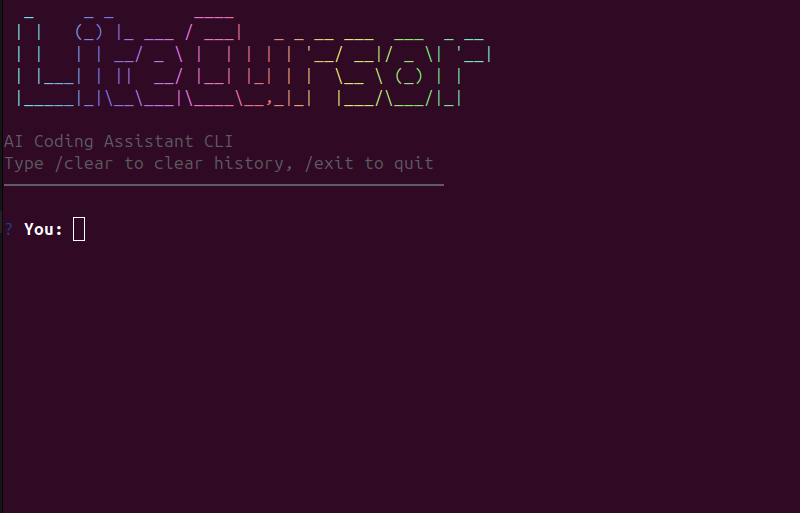

# litecursor
LiteCursor is a lightweight AI coding assistant CLI that can inspect project files, edit code, and run terminal commands through tool calling.

I built LiteCursor because I wanted an AI coding tool that is simple, affordable, and fully under my control.

Tools like Codex and Claude Code are powerful, but they can be expensive for small experiments. Sometimes I only need a few prompts to inspect files, edit code, or run a command, but I still hit limits quickly. I also wanted the freedom to choose smaller or cheaper models when a big model is not necessary.

LiteCursor is my attempt to make a minimal AI coding assistant that does the essential things: read the project, modify files, run commands, and help me code directly from the terminal.

## Screenshot 

